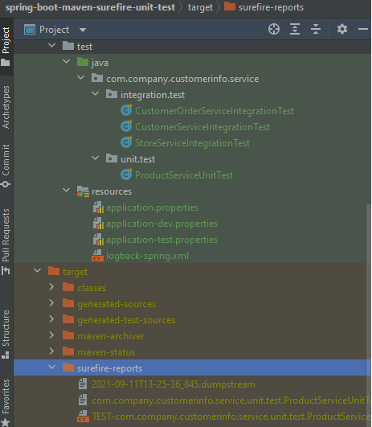

## spring-boot-maven-surefire-unit-test

1- Purpose : Customize maven test phase to execute only unit tests  
2- Reason : maven-surefire-plugin executes all the Test classes in test/java directory but we want to only execute unit tests for each maven build.  
3- To execute only specified unit tests for each maven build from the console run the following maven command :  
NOT : Execute maven command from where the pom.xml is located in the project directory.  
<pre> 
$ mvn clean install  
</pre>

[INFO] --- maven-surefire-plugin:3.0.0-M5:test (default-test) @ spring-boot-maven-surefire-unit-test ---  
[INFO]  
[INFO] -------------------------------------------------------  
[INFO]  T E S T S  
[INFO] -------------------------------------------------------  
[INFO] Running com.company.customerinfo.service.unit.test.ProductServiceUnitTest  
[INFO] Tests run: 2, Failures: 0, Errors: 0, Skipped: 0, Time elapsed: 0.747 s - in com.company.customerinfo.service.unit.test.ProductServiceUnitTest  
[INFO]  
[INFO] Results:  
[INFO]  
[INFO] Tests run: 2, Failures: 0, Errors: 0, Skipped: 0  

4- surefire-reports can be accessed from the application directory : "target/surefire-reports"  

  

### Tech Stack
Java 11  
H2 Database Engine  
spring boot  
spring boot starter data jpa  
spring boot starter web  
spring boot starter test  
hibernate  
logback  
maven  
maven-surefire-plugin  
springfox-swagger-ui  
datasource-proxy  
Docker  
 

### Docker build run steps
NOT : Execute docker commands from where the DockerFile is located.  
<pre>
$ docker system prune  
$ docker build . --tag demo   
$ docker run -p 8080:8080 -e "SPRING_PROFILES_ACTIVE=dev" demo:latest  
</pre>

## API OPERATIONS
### Save store with products successfully to database

Method : HTTP.POST  
URL : http://localhost:8080/customer-info/store/save  

Request : 
<pre>
curl --location --request POST 'http://localhost:8080/customer-info/store/save' \
--header 'Content-Type: application/json' \
--data-raw '{
  "name": "jeans_store",
  "products": [
    {
      "name": "prod1"
    },
    {
      "name": "prod2"
    },
    {
      "name": "prod3"
    }
  ]
}'
</pre> 

Response : 

HTTP response code 200  
<pre>
{
    "id": 1,
    "name": "jeans_store",
    "products": [
        {
            "id": 1,
            "name": "prod3"
        },
        {
            "id": 2,
            "name": "prod1"
        },
        {
            "id": 3,
            "name": "prod2"
        }
    ]
}
</pre>

### List Store saved to database

Method : HTTP.GET  
URL : http://localhost:8080/customer-info/store/list  

Request : 
<pre>
curl --location --request GET 'http://localhost:8080/customer-info/store/list'
</pre> 

Response : 

HTTP response code 200  
<pre>
[
    {
        "id": 1,
        "name": "jeans_store",
        "products": [
            {
                "id": 1,
                "name": "prod3"
            },
            {
                "id": 2,
                "name": "prod1"
            },
            {
                "id": 3,
                "name": "prod2"
            }
        ]
    }
]
</pre> 
